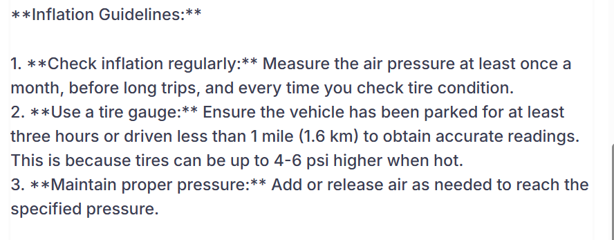
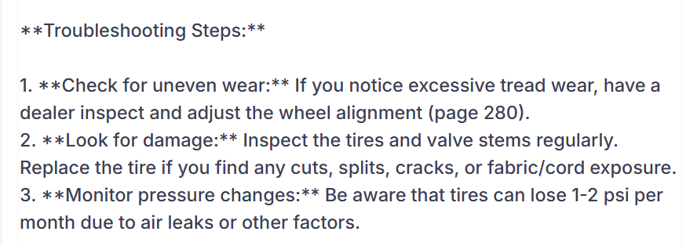
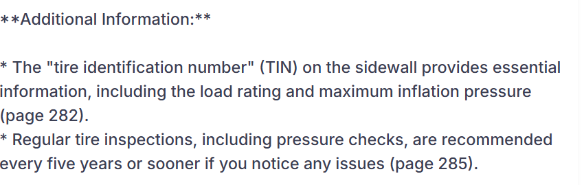
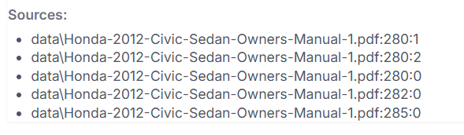

🚗 Car Information RAG Chatbot

Ever wished you could just ask questions about your car manual and get direct answers? This chatbot does exactly that. It intelligently scans your car PDFs (manuals, service guides, etc.), understands the content, and answers your queries with relevant, sourced responses.

Think of it as your personal car knowledge assistant—powered by Retrieval-Augmented Generation (RAG), a vector database, and flexible Large Language Models (LLMs).

________________________________________________________________________________________________________
🔧 Features
Document Ingestion – Easily load your own PDF manuals into a searchable knowledge base

Vector Store (Chroma) – Fast, semantic document retrieval

AI Integration – Plug in various LLMs for flexible deployment (default: Ollama)

Web GUI – Intuitive chat interface with real-time responses

Source Citations – Shows where answers were found (document + page) So no FAKE and MAKEUP AI Answer.

________________________________________________________________________________________________________

🗂 Project Structure
📁 data/                  # Store your car PDFs here  
📁 chroma/                # Auto-generated Chroma DB directory  
📄 get_embedding_function.py  # Choose your embedding model (Ollama by default)  
📄 populate_database.py       # Load + embed PDFs into the Chroma DB  
📄 query_data.py              # Query the DB and generate answers using LLMs  
📄 app.py                    # Flask backend API  
📄 chatbot_gui.html          # Frontend GUI (HTML/JS/CSS)  
📄 test_rag.py               # Optional test suite for RAG functionality  
🚀 Quickstart
1. Install Prerequisites
Python 3.8+

Ollama (default LLM setup)

pip (Python package installer)

 
Pull default models via Ollama

bash
ollama pull mxbai-embed-large
ollama pull llama3.1:8b
ollama pull mistral  # Optional, for running tests

2. Clone the Repository
bash
git clone https://github.com/your-username/your-repo-name.git
cd your-repo-name
3. Install Dependencies
bash
pip install -r requirements.txt
> ⚠️ You may see LangChain deprecation warnings—functionality remains unaffected but keeping packages updated is encouraged.

4. Add Your Documents
Place all your PDF car manuals into the data/ folder.

5. Populate the Vector Database
bash
python populate_database.py --reset
> The --reset option clears existing data for a clean start.

6. Start the Backend Server
bash
python app.py
Backend starts at: http://127.0.0.1:5000/

7. Launch the Chatbot Interface
Open chatbot_gui.html in a browser:

bash
start chatbot_gui.html  # Windows
# or double-click the file in your file explorer
🤖 Customizing the Models
You can easily swap out LLMs or embedding backends:

🔤 Change the Embedding Model
Edit get_embedding_function.py.

Default (Ollama):

python
from langchain_ollama import OllamaEmbeddings

def get_embedding_function():
    return OllamaEmbeddings(model="mxbai-embed-large")
Switch to AWS Bedrock or OpenAI (example):

python
from langchain_community.embeddings.bedrock import BedrockEmbeddings

def get_embedding_function():
    return BedrockEmbeddings(
        credentials_profile_name="default",
        region_name="us-east-1"
    )
💬 Change the Language Model
Edit query_data.py.

Default (Ollama):

python
from langchain_community.llms.ollama import Ollama

model = Ollama(model="llama3.1:8b")
Example: Google Gemini or OpenAI:

python
from langchain_google_genai import ChatGoogleGenerativeAI

model = ChatGoogleGenerativeAI(model="gemini-pro", temperature=0.7)
> Install any required SDKs for your chosen providers: > - pip install langchain-openai > - pip install langchain-google-genai

🧪 Testing (Optional)
bash
python test_rag.py
Validates basic RAG behavior across sample prompts.

🤝 Contributing
Pull requests, suggestions, and issues are welcome. Fork freely and innovate.

📄 License
Licensed under the MIT License.
